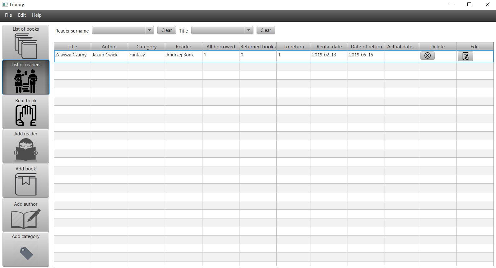

# LibraryApp
Application for managing library

#### Stack
* Java 8, JavaFx, Hibernate, MySQL, Mockito, JUnit5, Lombok, Maven, 
* Tools: MySql Workbench, SceneBuilder

#### Features

- [x] Adding, editing and deleting category, author, book, reader, order 
- [x] Notification for deleting 
- [x] Validation for adding, editing and deleting category, author, book, reader, order 
- [x] Validation for borrowing book 
- [x] Each category shows a list of books in which it is concluded
- [x] Sorting books by category and/or author
- [x] Sorting orders by reader and/or book
- [x] Sorting readers by name  or surname
- [x] Sorting authors by name  or surname
- [x] Changing language to polish or english
- [x] Changing style app 
- [x] Setting app always on top
- [x] Showing information about app after clicking in section HELP


#### Examples of some features





#### Prerequisites
Application requires running MySQL database with 
* schema name: library
* user: root
* password: password
 
#### Build and run Java application 

```sh
$ mvn clean install
```
```sh
$ java -jar target/MyLibrary-1.0-SNAPSHOT.jar
```

#### Run Java tests:
```sh
$ cd backend && mvn test
```


